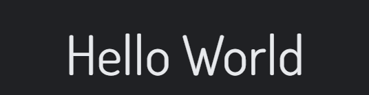

# Coding Library

## Introduction

Coding Library is a coding related community based social media website. Where users can see helpful posts from other users or they can create their own posts on coding-related topics to help other users out. If the post is helpful, users may comment or like it, bookmark it, or follow the user who posted it.

## Preview

- ### Live View For [Project5 Coding Library Frontend ](https://p5-coding-library.herokuapp.com/)

- ### Github Repository For [Coding Library DRF-API Backend ](https://github.com/hashim222/coding-library-drf-api)

- ### Live View For [Coding Library DRF-API Backend ](https://coding-library-drf-api.herokuapp.com/)

## UX

- ### Flowchart

  - Flowchart was created before I created the project, which gave me an idea of which user has access to which page and what each link should be doing.

    > Note: Flowchart was created before starting the project but forgot to include `Create Posts` for logged in users. Therefore, the flowchart may not match 100% with the final deployed version due to changes were made in the development.

    

- ### Color scheme

  - Using Google, I researched what colors are best for a coding-related website that is also user-friendly, and I decided to go with light blueish, dark blueish, white, and light white tones.

    

- ### Font Used

  - To make the website stand out for UX, I used font Oswald and font Dosis:

    - 'Oswald', sans-serif  
      

    - 'Dosis', sans-serif  
      

- ### Wireframe

  - Site wireframe can be seen in the [wireframe.md](wireframe.md) file.

- ### Agile Methodology

  - Project github issues can be accessed [here](https://github.com/hashim222/p5-coding-library/issues).

  - To make my kanban board public, I changed visibility from private to public in project settings and It can be accessed here [here](https://github.com/users/hashim222/projects/11).

- ### User Stories
  You can view all the user stories and admin stories [here](user-story.md)

## Features

- ### Existing Features

- ### Future Features
  - In the future I would like to add a chat option, which would allow users to communicate privately with each other.
  - In the future, I would like to add an option for struggling users to post their code so members of the community can help them with their issues.

## Testings

## Bugs

- ### Fixed Bugs

- ### Unfixed Bugs

  - One of the issues I encountered was that when user/owner clicked on the three-dot icon to edit their profile or post, the dropdown menu would open at the top of the Popular profile page, which I did not want. To fix it, I tried adding margin, but that caused a console error, so I stayed with the previous issue and documented it in the readme.

    

    

## Technologies Used

The following technologies were used throughout the development of the project:

- ### Language Used

  - [HTML](https://www.w3schools.com/html/)
  - [CSS](https://www.w3schools.com/css/)
  - [Javascript](https://en.wikipedia.org/wiki/JavaScript)

- ### Libraries/Framework Used

  - [Bootstrap5](https://getbootstrap.com/)
  - [React-Bootstrap5](https://react-bootstrap.github.io/)
  - [React js](https://getbootstrap.com/)

- ### Other Technologies

  - [W3School](https://www.w3schools.com/)
  - [Stackoverflow](https://stackoverflow.com/)
  - [Git](https://git-scm.com/)
  - [Github](https://github.com/)
  - [Gitpod workspace](https://gitpod.io/workspaces)
  - [Heroku](https://dashboard.heroku.com/apps)
  - [Flowchart](https://lucid.app/documents#/documents?folder_id=home)
  - [coolors](https://coolors.co/)
  - [Balsamiq Wireframes](https://balsamiq.com/wireframes/)
  - [Font Awsome](https://fontawesome.com/)
  - [Google Fonts](https://fonts.google.com/)
  - [Slack](https://slack.com/intl/en-gb/)
  - [geeksforgeeks](https://www.geeksforgeeks.org/)
  - [Diff checker](https://www.diffchecker.com/text-compare/)
  - [Am i responsive](https://ui.dev/amiresponsive)

## Components

- ### The following components have been implemented in this project and reused throughout:
  - **Asset:** Using this component, spinners are loaded throughout the site and user messages are displayed if search results are not found.

## Deployments

## Credits

- ### Content
- ### Media
  - `404 graphic` was taken from [Vecteezy](https://www.vecteezy.com/?utm_source=vecteezy-download&utm_medium=license-info-pdf&utm_campaign=license-info-document) website.
