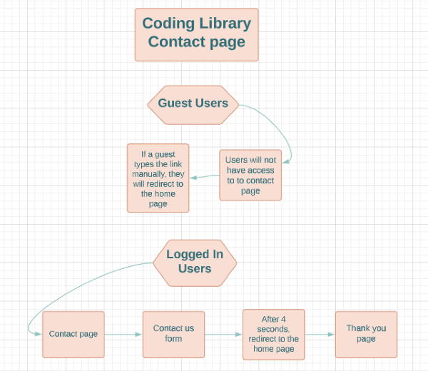
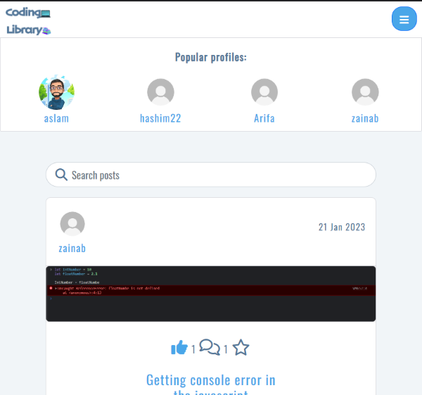

# Coding Library

## Introduction

Coding Library is a coding related community based social media website. Where users can see helpful posts from other users or they can create their own posts on coding-related topics to help other users out. If the post is helpful, users may comment or like it, bookmark it, or follow the user who posted it.

> **Note**: In order to achieve a merit grade, I created a last-minute ContactForm model based on a suggestion from my newly appointed mentor. Some of the places that you may notice that I'm not mentioning about the contact page are due to last minute changes that I added.

## Preview

- ### Live View For [Project5 Coding Library Frontend ](https://p5-coding-library.herokuapp.com/)

- ### Github Repository For [Coding Library DRF-API Backend ](https://github.com/hashim222/coding-library-drf-api)

- ### Live View For [Coding Library DRF-API Backend ](https://coding-library-drf-api.herokuapp.com/)

## UX

- ### Flowchart

  - Flowchart was created before I created the project, which gave me an idea of which user has access to which page and what each link should be doing.

    > Note: Flowchart was created before starting the project but forgot to include `Create Posts` for logged in users. Therefore, the flowchart may not match 100% with the final deployed version due to changes were made in the development.

    

  - Contact page flowchart.

    

- ### Color scheme

  - Using Google, I researched what colors are best for a coding-related website that is also user-friendly, and I decided to go with light blueish, dark blueish, white, and light white tones.

    

- ### Font Used

  - To make the website stand out for UX, I used font Oswald and font Dosis:

    - 'Oswald', sans-serif  
      

    - 'Dosis', sans-serif  
      

- ### Wireframe

  - Site wireframe can be seen in the [wireframe.md](wireframe.md) file.

- ### Agile Methodology

- This project was created using the agile methodology and github issue boards.

  - Project github issues can be accessed [here](https://github.com/hashim222/p5-coding-library/issues).

  - To make my kanban board public, I changed visibility from private to public in project settings and It can be accessed here [here](https://github.com/users/hashim222/projects/11).

- ### User Stories
  You can view all the user stories and admin stories [here](user-story.md)

## Features

- ### **Existing Features**

  - #### **Guest User Site Sidebar**

    - Guest users will have access to all of these links in the sidebar of the website, and by clicking each link they will be taken to other pages on the site.

       

  - #### **Logged In User Site Sidebar**

    - Logged in users will have access to all of these links in the sidebar of the website, and by clicking each link they will be taken to other pages on the site.

        

  - #### **Home Page**

    - On the home page, the user can scroll down to see all the posts created by other users in the app so far

      

    - Each post can be searched either by typing the title of the post or by typing the username. Only the home page, followings feed, and bookmarked topics pages display the search bar option.

      

  - #### **About Page**

    - By clicking on the `about us` link from the sidebar, the user is directed to the About page, which provides information about the app and what to expect from it.

      

       

  - #### **Create Topic Page**

    - By clicking on the `Create Topic` link from the sidebar, the user is directed to the create post form. Here the user can upload their image, add a post title, and caption of the post.

      
      
      

    - The user will receive an error message if they forget to fill out one of the fields or upload an image that is larger than 2MB.

      

    - Upon successfully creating the post, the user will be redirected to the post detail page where they can see what they have posted.

      

  - #### **Post Detail Page**

    - Post owners can edit and delete their posts by clicking the three dots icon at the top of the page.

      

    - If the post caption has a lot of text, a scrollbar will show up, which is added for users to move quickly to the next post.

      

    - Other logged-in users will be able to like, bookmark, and comment on the post. Each time a user likes and comments, the number of likes and comments will increase.

      > **Note**: Owners of posts and guest users will not be able to like posts. However, post owners can comment on their own post.

      

    - The comment owner can see the three dots icon button at the top of the comment they made, and by clicking the pencil icon, they can edit their comments. They can also click on the trash icon button to remove their comment from the post.

      

  - #### **Followings Feed Page**

    - By clicking on the `Followings Feed` link from the sidebar, the user will directed to the followings feed page. Here they can see all the posts from the users they are following.

    - A popular profile component will be displayed on all pages of the site.

      

      

    - New users will not see any feeds unless they follow a user who has posted something.

      

    - Logged in users will have access to the follow and unfollow buttons on the popular profile section. After clicking the follow button, a user will see the unfollow button, both in the popular profile section and on their profile page.

      

      

    - Each time a user follows another user, the following count will go up for the user who is following and the follower count will go up for the user he just followed.

    - Users can unfollow users if they don't want to receive feeds from the user they are following.

  - #### **Bookmarked Topic Page**

    - By clicking on the `Bookmarked Topic` link from the sidebar, the user will be directed to the bookmarked topic page. Here they can see all the posts they've bookmarked.

    - To remove a post from the bookmarked page, click the bookmark icon again on the posts they are not interested in, and the bookmark icon will lose its light blue background colour. After refreshing the page the post will be removed from `Bookmarked Topic` page.

      

      

    - Users who have not bookmarked any posts will not see any posts on the page.

      

  - #### **Contact Us Page**

    - By clicking on the `Contact Us` link from the sidebar, the user will be directed to the contact us form. Here they can contact the site admin.

    - Upon completing the form, users will be sent to the thank you page, and after 4 seconds, they will be redirect to the home page.

      

      

    - The admin of the site can see the message in the admin panel.

      

  - #### **Logout**

    - By clicking on the `Logout` link from the sidebar, a modal will display which will ask the user Are you sure you want to logout? By clicking no, they will be taken back to the previous page they were in, and by clicking yes, they will be logged out.

  - #### **My Profile Page**

    - By clicking on the `My Profile` link from the sidebar, the user will directed to the my profile page.

    - The profile page displays the user's username, profile avatar, posts count, followers count, followings count, name of profile owner, coding experience, favourite programming language, about me, and profile posts.

    - The profile owner can edit the profile, change the username, and change the password by clicking the three dots icon at the top of the page.

    - A block icon will show up in the owner's profile if no fields have been updated yet, which will disappear after updating the fields.

  - #### **Sign up Page**

    - By clicking on the `Sign Up` link from the sidebar, new users can register with the site, and after successfully registering, users are directed to the sign in page.

    - The user does not have to sign up if they already have an account; they can just sign in with their existing credentials

  - #### **Sign In Page**

    - By clicking on the `Sign In` link from the sidebar, users can sign in if they already have an account, if not they must sign up first.

  - #### **Page Not Found**

- ### Future Features
  - In the future I would like to add a chat option, which would allow users to communicate privately with each other.
  - In the future, I would like to add an option for struggling users so they can add the part of the code they are working on and multiple images can be sent, so members of the community can better understand the issue and can help them.
  - When creating a post or comment, users can choose between a variety of text styles for the textfields.
  - To make signing up easier for new users, I would like to add an option of a one-click signup button where users who already have an account with Google or Facebook, can sign up by simply clicking on Google or facebook.
  - A better login and registration form will be added in the future, and users will only be allowed to register if they verify their email address.

## Testings

- testings can be seen by going into the [testings.md](testings.md) file.

## Bugs

- ### Fixed Bugs

  - At the beginning of the project, I encountered this bug when I tried to fetch a request from the API for the first time for a signup form, which after submitting would take me to an empty page with a lot of console errors. The issue was so frustrating that even a few tutors were unable to determine what was causing it. Later on, another tutor asked me if the link in the Axios default was correct, and that turned out to be the issue. The link I added was for the deployed frontend, not the backend deployed API. Replacing it with the deployed API link fixed the problem.

    

- When guest users try to add `/bookmarked_topics` to the url manually, they could see all posts that were bookmarked by other users. So to fix this bug, I've already created a custom `UseRedirect()` hook with the help of CI moments walkthrough project, which redirects guest users to the homepage if they try to access the authorized content. Adding `UseRedirect("loggedOut")` to the PostsPageContent fixed the bug for me.

- ### Unfixed Bugs

  - One of the issue I encountered was that when user/owner clicked on the three-dot icon to edit their profile or post, the dropdown menu would open at the top of the Popular profile page, which I didn't wanted. To fix it, I tried adding margin, but that caused a console error, so I stayed with the previous issue and documented it in the readme.

    

    

  - I encountered the memory leak bug on the EditProfilePage page whenever I tried to edit the form.
    So I contacted the tutor support, and even they couldn't figure out what was wrong. Later on Oisin/tutor sent me a [document](https://stackoverflow.com/questions/71258604/how-to-fix-react-warning-cant-perform-a-react-state-update-on-an-unmounted-co), Which says that this is a bug in react that will be fixed in the future and my mentor suggested that I should add this to the unfixed bug section in the readme.

    

    

  - It's not just me; even the Code Institute Moment project has this bug too. In both cases, users can access the deleted post edit form, and when they try to submit the form, the form will not submit, but in the console a `404 not found` error is displayed for the logged in user, and for a guest user `503(Service Unavailable)` error is displayed. I found out about this during the manual testing I was doing for my project. Even though users cannot do much with it, I still wanted to mention it in the bug section, and I will look into this in the future.

    - **Deleted Post**

      

    - **Guest user has access to the deleted post edit form**

      

    - **Logged in user has access to the deleted post edit form**

      

## Technologies Used

The following technologies were used throughout the development of the project:

- ### Language Used

  - [HTML](https://www.w3schools.com/html/)
  - [CSS](https://www.w3schools.com/css/)
  - [Javascript](https://en.wikipedia.org/wiki/JavaScript)

- ### Libraries/Framework Used

  - [Bootstrap5](https://getbootstrap.com/)
  - [React-Bootstrap5](https://react-bootstrap.github.io/)
  - [React js](https://getbootstrap.com/)

- ### Other Technologies

  - [W3School](https://www.w3schools.com/)
  - [Stackoverflow](https://stackoverflow.com/)
  - [Git](https://git-scm.com/)
  - [Github](https://github.com/)
  - [Gitpod workspace](https://gitpod.io/workspaces)
  - [Heroku](https://dashboard.heroku.com/apps)
  - [Flowchart](https://lucid.app/documents#/documents?folder_id=home)
  - [coolors](https://coolors.co/)
  - [Balsamiq Wireframes](https://balsamiq.com/wireframes/)
  - [Font Awsome](https://fontawesome.com/)
  - [Google Fonts](https://fonts.google.com/)
  - [Slack](https://slack.com/intl/en-gb/)
  - [geeksforgeeks](https://www.geeksforgeeks.org/)
  - [Diff checker](https://www.diffchecker.com/text-compare/)
  - [Am i responsive](https://ui.dev/amiresponsive)
  - [whimsical Wireframe](https://whimsical.com/)

## Components

- ### The following components have been implemented in this project and reused throughout the app:
  - **Asset:** Using this component, spinners are loaded throughout the site and user messages are displayed if search results are not found.
  - **Avatar:** Users can identify each other more easily with the help of this component, which is used throughout the site for user profile images.
  - **DropdownToggle Page:** In the app, this component is used to edit posts and profiles by users/owners.
  - **SideNavBar:** This component is present on every page of the application. The user can access most site features in one place, from any page, which improves UX. It also collapses into a sidenavbar menu for screen sizes medium and below.
  - **LoggedInIcons:** Using this component, logged in users will be able to access all app links from the sidenavbar.
  - **LoggedOutIcons:** Using this component, guest users will be able to access all app links from the sidenavbar.
  - **NotFound:** Invalid urls were handled by this component. If users try to input invalid urls, they will see a page not found message.
  - **UseRedirect:** When users access a page they shouldn't be viewing, this component redirects them to their home page.
  - **UseClickOutsideToggle:** This component helps collapse a sideNavBar menu by clicking any link within the menu or by clicking outside the menu to collapse it for a smooth UX. Which By default, you must click on each link in the sidenavbar menu and then press the hamburger icon again to collapse it.

## Deployments

## Credits

- ### Content

- ### Media
  - `404 graphic` was taken from [Vecteezy](https://www.vecteezy.com/?utm_source=vecteezy-download&utm_medium=license-info-pdf&utm_campaign=license-info-document) website.
