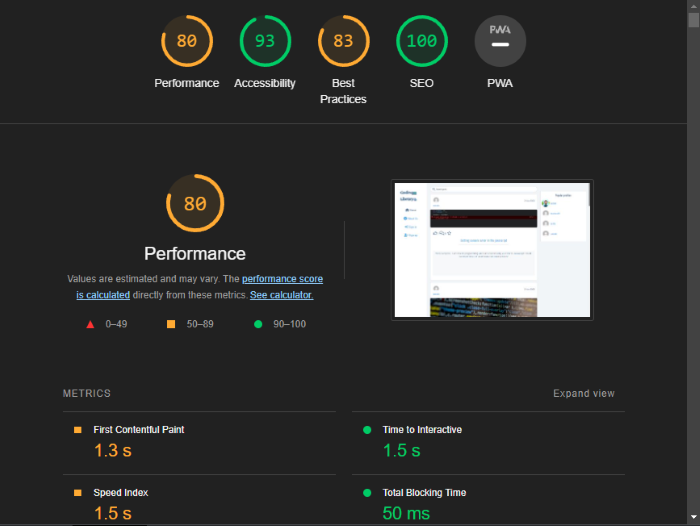
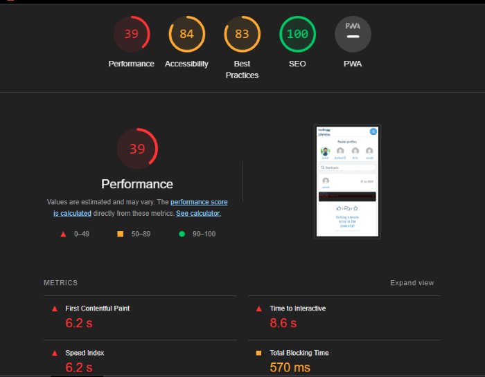

# Testings

Both the development and deployed versions of this project has been manually tested multiple times.

## Feature Testings

- **Profile TestCases**

  

- **Post TestCases**

  

- **Comment TestCases**

  

- **Contact Form TestCases**

  

- **Auth TestCases**

  

- **Redirect Users TestCases**

  

## Eslint

Eslint was installed and configured locally. There was a lot of random errors were showing up, so I've added a custom `rules` to the `.eslintrc.json` file with help from alumni student Ian Meigh in the Slack channel.

- Following errors were detected by ESLint and ran this command `./node_modules/.bin/eslint src/*.js` which finds all the errors in the directory files.

  > **Note**: Few places I've used `// eslint-disable-next-line` to disable eslint for a specific line because eslint was picking up random errors.

  - **`./node_modules/.bin/eslint src/*.js`**

    

  - **`./node_modules/.bin/eslint src/**/*.js`**

    

  - **`./node_modules/.bin/eslint src/**/**/*.js`**

    

## Lighthouse Check

- When I performed the Lighthouse test on my laptop, I received a performance score of 22. This has previously been an issue on my laptop too, as the lighthouse score was displaying a lower score on previous projects. So I asked my friend to check the lighthouse on his desktop, and I had a performance score of 80, and a best practice score of 83. However, mobile results were still low for two main reasons: serve images in next-generation formats and reduce unused JavaScript. Unfortunately, I did not have enough time to fix those in this iteration. But I will fix those in the future.

  - ### Desktop

    

  - ### Mobile

    

## W3C CSS Code Validator

- All CSS code passed through the validator with no issues:

  
