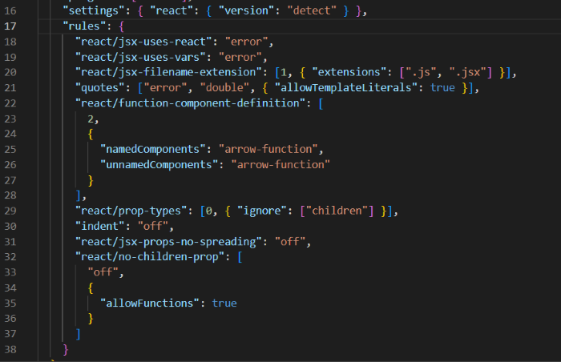
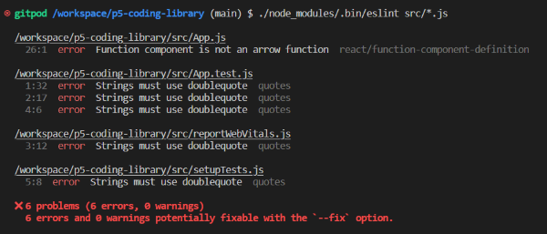
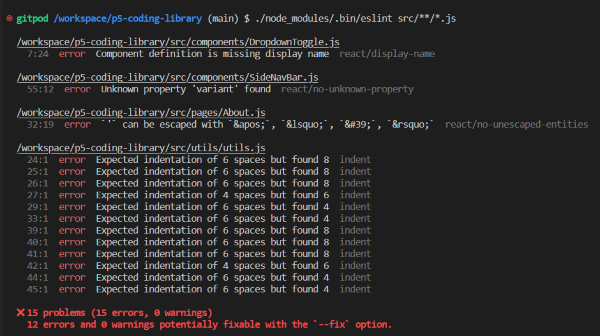
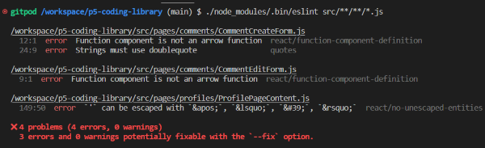
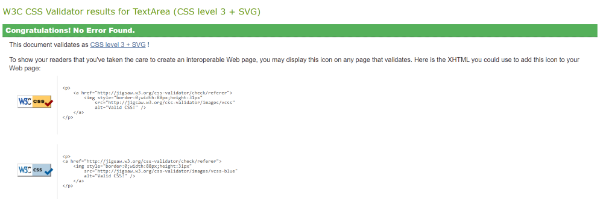

# Testings

Both the development and deployed versions of this project has been manually tested multiple times.

## CRUD Functionality Testings

## Eslint

Eslint was installed and configured locally. There was a lot of random errors were showing up, so I've added a custom `rules` to the `.eslintrc.json` file with help from alumni student Ian Meigh in the Slack channel.

- Following errors were detected by ESLint and ran this command `./node_modules/.bin/eslint src/*.js` which finds all the errors in the directory files.

  > **Note**: Few places I've used `// eslint-disable-next-line` to disable eslint for a specific line because eslint was picking up random errors.

  - **`./node_modules/.bin/eslint src/*.js`**

    

  - **`./node_modules/.bin/eslint src/**/*.js`**

    

  - **`./node_modules/.bin/eslint src/**/**/*.js`**

    

## Lighthouse Check

## W3C CSS Code Validator

- All CSS code passed through the validator with no issues:

  
