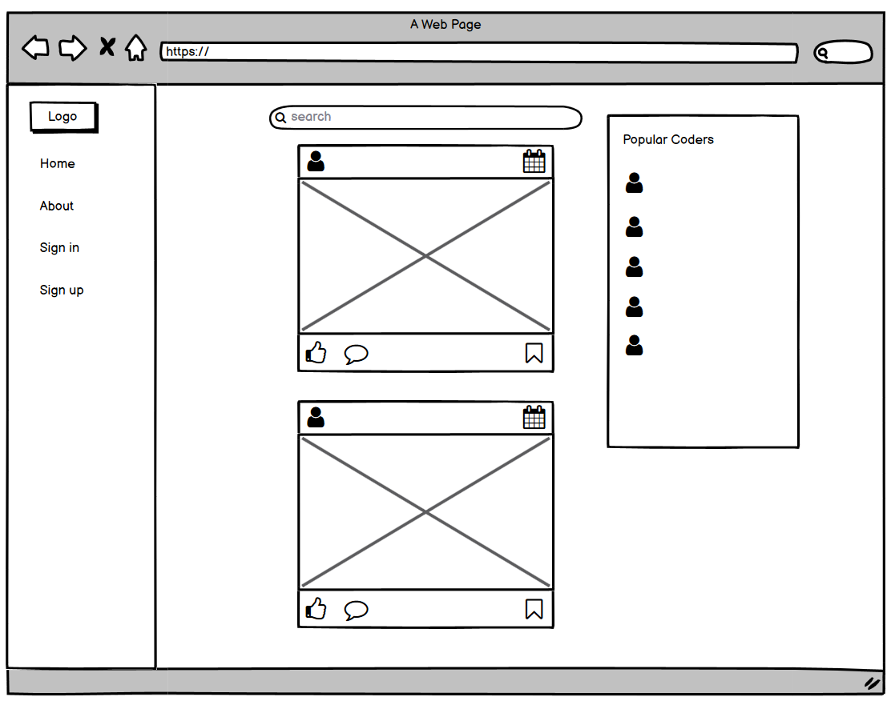
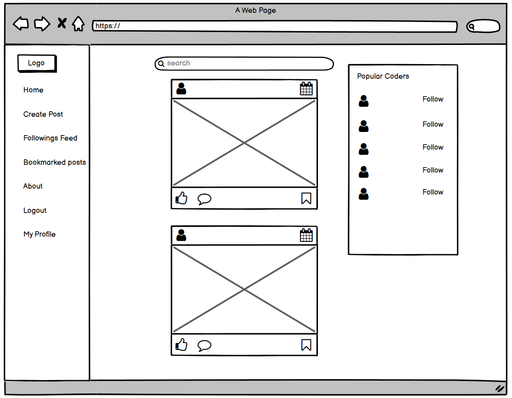
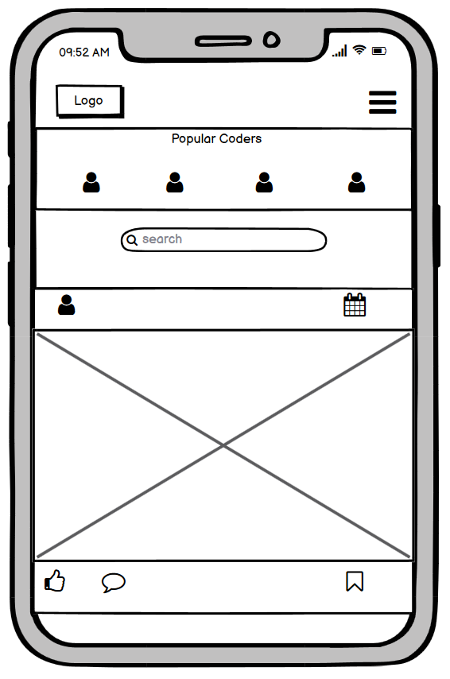
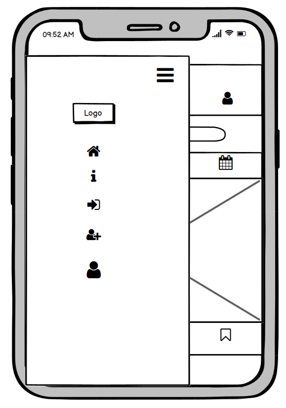

# Sites Wireframe

Wireframe was created before I started working on the frontend. Throughout the development process, changes were made to the project, so the deployed version might not match 100% with the wireframe.

- ### Large Devices For The Guest Users

  

- ### Large Devices For The Logged In Users

  

- ### Smaller Devices

  

- ### Smaller Devices For The Guest Users

  

- ### Smaller Devices For The Logged In Users

  
