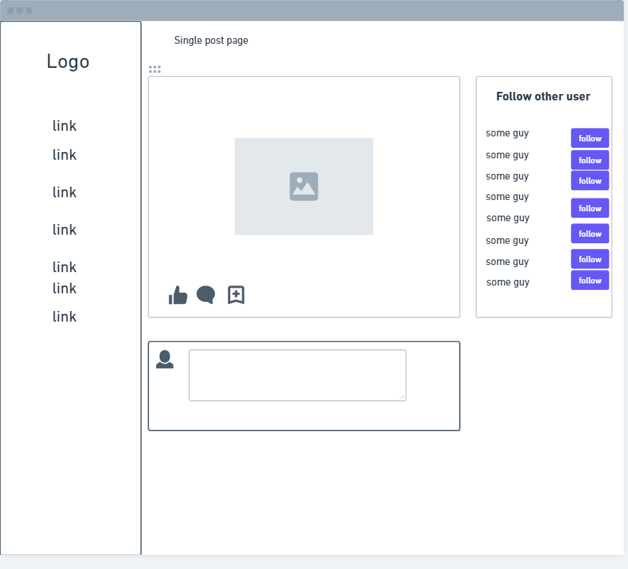
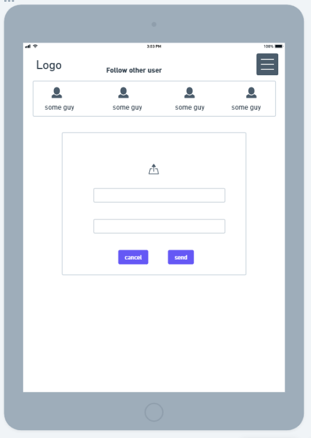

# Sites Wireframe

Wireframe was created before I started working on the frontend. Throughout the development process, changes were made to the project, so the deployed version might not match 100% with the wireframe.

- ### Large Devices For The Guest Users

  

- ### Large Devices For The Logged In Users

  

- ### Smaller Devices

  

- ### Smaller Devices For The Guest Users

  

- ### Smaller Devices For The Logged In Users

  

> **Note**: While I started with [Balsamiq Wireframe](https://balsamiq.com/wireframes/) to create my projects wireframe, my licence expired halfway through. I then used [whimsical Wireframe](https://whimsical.com/) to create the rest of the pages of my site's wireframe.

- ### Single Post Page For Larger Devices

  

- ### Single Post Page For Smaller Devices

  

- ### Create a Post Page For Larger Devices

  

- ### Create a Post Page For Smaller Devices

  

- ### My Profile Page For Larger Devices

  

- ### My Profile Page For Smaller Devices

  
